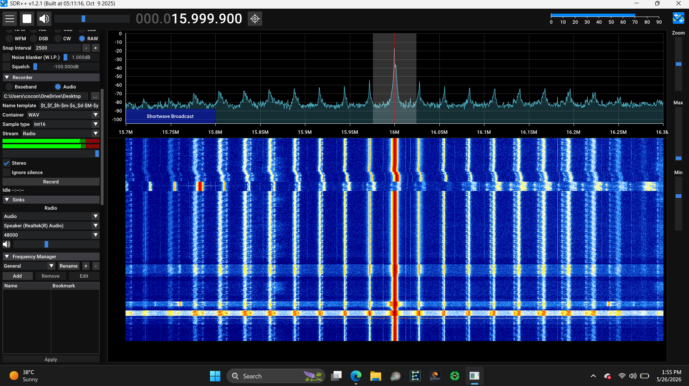
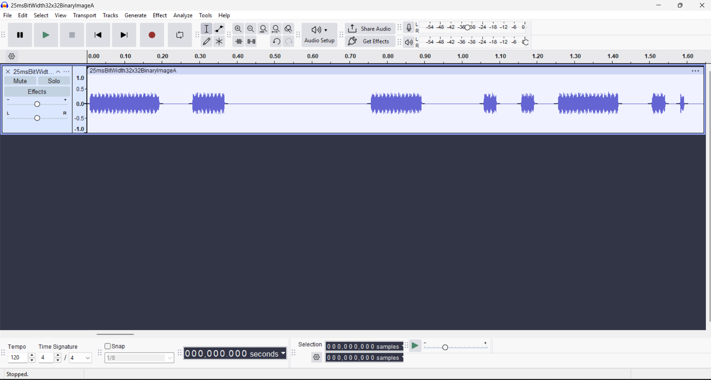

**REQUIRED MATERIALS:**

&#x20;• a software defined radio(SDR) for signal recording and sdr software(sdr++ works best)

&#x20;• microcontroller with Encoded data and a Transmitter circuit

&#x20;• audio editing software (audacity works best)

**How to setup:**

&#x20;• draw your image using the program contained in the folder called "BinaryImageTotextFile" 

&#x20;• use right click to draw pixels and left click to delete pixels

&#x20;• press space to write data to file

&#x20;• pressing space allows you to only write the image data once in order not to overwrite to a file when space is

&#x20;  pressed multiple times

&#x20;• on the SDR software set the signal decoding to CW and set the tone frequency to a high value but half the audio sample rate due to sampling limitations(nyquist sampling theorem), @48000hz, 1250hz tone

once everything is setup you will have the binary image as a text file in the folder directory "BinaryImageToTextFile\output"

open the file and copy all of the data inside.

Next open the .ino file in the folder directory "BinaryOutputToMcu" and delete the elements of the Binary data array if there is existing data.

once the array is empty copy all of the data from the binary image text file to the array ONCE.

once done plug in your desired micro controller and upload the code then wire the digital write pin to the optocoupler anode(MUST HAVE A CURRENT LIMITING RESISTOR AROUND 220 ohms - 2k) and the MCU ground to the optocoupler cathode.

when all of these steps are done turn on the transmitter and MCU to begin transmitting data over air and use your SDR to log the data

to a .wav file

**How to process the .wav file**:

&#x20;open the file in the desired audio editing program and align the left side crop to the exact start of the first preamble bit

&#x20;once done save the cropped audio file and include it in the OOKdecoder.py program to see your results (Adjust the threshold variable  value to get the desired output)

**extra information**:

&#x20;• the preamble and postamble contains 8 bits where all bits are on (used as the cropping reference)
 • the transmitter has a bit width of 25ms meaning that it transmits 1000ms/25ms bit width= 40bits/second so a 32\*32 image (1040 bits pre/post amble included) will take around (imageBitSize+preamble+postamble)/ bits per second or in our case 1040bits/40bits per second = 26 seconds for transmission

• the bit width can be reduced for faster data transfer but due to circuit limitations it might not give the expected result due to voltage not ramping fast enough (best signal quality @ 25ms bit width)

**Transmission recording**

https://github.com/user-attachments/assets/ad18c15b-58a2-4aff-95e0-3f11218b6731

